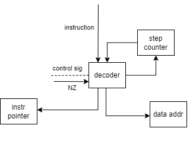

# itmo-csa-lab3
## третья лаба по АК

- Янковой Леонид P3232
- Варинат `lisp -> asm | acc | harv | hw | tick -> instr | struct | stream | port | pstr | prob2 | cache`
Без усложнения

## Язык программирования Lisp
```
    <program> ::= <statement_list>

<statement_list> ::= <statement> | <statement> <statement_list>

<statement> ::= <var_declaration>
              | <if_statement>
              | <defunc_declaration>
              | <while_statement>
              | <function_call>
              | <print_string>
              | <read_line>

<var_declaration> ::= "(var" <identifier> <expression> ")"

<if_statement> ::= "(if" <condition> <statement_list> <statement_list> ")"

<defunc_declaration> ::= "(defunc" <identifier> "(" <parameter_list> ")" <statement_list> ")"

<while_statement> ::= "(while" <condition> <statement_list> ")"

<function_call> ::= "(funcall" <identifier> "(" <argument_list> "))"

<print_string> ::= "(print_string" <string> ")"

<read_line> ::= "(read_line" <identifier> ")"

<condition> ::= "(" <comparison_operator> <expression> <expression> ")"

<comparison_operator> ::= ">" | "<" | "="

<expression> ::= <number>
              | <identifier>
              | "(" <operator> <expression> <expression> ")"

<operator> ::= "+" | "-" | "*" | "/"

<parameter_list> ::= <identifier> | <identifier> <parameter_list>

<argument_list> ::= <expression> | <expression> <argument_list>

<identifier> ::= <letter> | <letter> <identifier_tail>

<identifier_tail> ::= <letter> | <digit> | <identifier_tail> 

<string> ::= "\"" <string_content> "\""

<string_content> ::= <character> | <character> <string_content>

<character> ::= <letter> | <digit> | " " | "," | "!" | "?"

<letter> ::= "a" | "b" | ... | "z" | "A" | "B" | ... | "Z"

<digit> ::= "0" | "1" | ... | "9"

<number> ::= <digit> | <digit> <number>

```

### Семантика

Код выполняется последовательно  
Операции:
- `var` - объявить переменную
- `set` - присвоить переменной значение
- `if` - иф
- `while` - вайл
- `defunc` - объявление функции
- `funcall` - вызов функции
- `printc` - вывод char
- `print_string` - вывод строки
- `input` - ввод char
- `read_line` - ввод строки, окончанием строки ожидается `\n`

### Переменные
Переменные двух типов - ссылочные(string) и числовые - int  
объявить строку можно указав в качестве значения строковое значение, либо же размер строки `[x]`  
Существует две области видимости - глобальная и функциональная. Из функции невозможно обратиться к переменным извне, следует передавать их как аргументы.  
Любое выражение или вызов функции всегда возвращают последнее вычисленное выражение.  
Выполнение программы начинается с первого выражения, не считая объявления функций.  
Имена переменных и функций чувствительны к регистру.


## Организация памяти
Модель памяти процессора:

1. Память команд. Машинное слово -- не определено. Реализуется списком словарей, описывающих инструкции (одно слово -- одна ячейка).
2. Память данных. Машинное слово -- 32 бита, знаковое. Линейное адресное пространство. Реализуется списком чисел.

Для вызова функций используется _виртуальный_ стек - транслятор выделяет ячейку памяти, где будет храниться указатель стека  
Это решение упрощает архитектуру процессора и усложняет вызов функций. Решение было принято, поскольку **аккумуляторной** архитектуре нельзя использовать
арифметические операции не с аккумулятором (не получится сделать адресацию относительно указателя стека).  

Память данных условно разделена на 3 части
1. 0-256 - под переменные и статику.
2. 256-512 - стек, стек растет вниз.
3. 512-1024 - буферная память, выделяется компилятором для сохранения  
промежуточных результатов вычислений, когда регистров не хватает для алгоритма,  
а в нашем случае это примерно каждая операция, так как регистр у нас всего один.


## Система команд

#### Режимы адресации

| Режим    | Описание                                                                      |
|----------|-------------------------------------------------------------------------------|
| DIRECT   | В команде содержится адрес, по которому находится операнд                     |
| INDIRECT | В команде содержится адрес ячейки памяти, в которой содержится адрес операнда |

#### Набор машинных команд

| команда | описание           |
|---------|--------------------|
| add     | AC + operand       |
| mul     | AC * operand       |
| div     | AC / operand       |
| sub     | AC - operand       |
| cla     | 0 -> AC            |
| inc     | AC ++              |
| dec     | AC --              |
| in      | IN port -> AC      |        
| out     | AC -> OUT port     |
| jmp     | M -> IP            |
| je      | if ZF: M -> IP     |
| jne     | if not ZF: M -> IP |
| jn      | if NF: M -> IP     |
| jnn     | if not NF: M -> IP |
| ld      | M -> AC            |
| st      | AC -> M            |
| hlt     | останов            |


### Кодирование инструкций

- Машинный код сохраняется в формате JSON.
- Один элемент списка -- одна инструкция.
- Индекс списка -- адрес инструкции. Используется для команд перехода.

  пример:
```json
  [{
    "opcode": "cla",
    "arg": "",
    "addressingType": 0
  },
  {
    "opcode": "inc",
    "arg": "",
    "addressingType": 0
  },
  {
    "opcode": "bz",
    "arg": 20,
    "addressingType": 0
  }]
```

## Транслятор

Интерфейс командной строки: `translator.py <input_file> <target_file>"`

Реализовано в модуле: [lisp_translator](lisp_translator.py)

Трансляция происходит за один проход.  
Рекурсивно транслируются выражения по следующим правилам:
1. в выражении выделяется операция
2. в зависимости от операции транслируются аргументы, транслируются по очереди и при необходимости в память сохраняются промежуточные значения в случае если аргумент - выражение, то -> 1
3. по результатам трансляции в аккумулятор кладется результат последнего полезного вычисления

в целом можно сказать о некоем _соглашении о вызовах_ - после каждого выражения в аккумуляторе сохраняется полезное значение, которое используется по правилам транслируемой операции.  
В трансляторе присутствует минимальная оптимизация вычислений и памяти, например в случае с операциями, не требующими порядок операндов (+, *), а так же выделяемую память для буферных вычислений.

## Модель процессора

Реализовано в модуле: [machine](machine.py)

- аккумуляторная архитектура
- HW control unit
- port-mapped IO
- Остановка только по `HALT`

### DataPath

Состоит из АЛУ, аккумулятора, решистра данных, который по сути является защелкой для данных из памяти

Сигналы:
1. Защелки
   - `data address latch`- защелкнуть адрес для Data memory
   - `memory latch` - защелкнуть данные в память по адресу
   -  `data registry latch` - защелкнуть выход памяти в регистр данных
   - `output latch` - защелкнуть данные в порт вывода
   - `IP latch` - защелкнуть данные в счетчик команд
2. Управляющие
   - `address selector` - выбор адреса для памяти данных - либо напрямую из команды, либо из регистра данных
   - `io selector` - выбор записи в аккумулятор порта ввода или выхода алу
   - `cla` - левый вход алу - 0/AC
   - `cld` - правый вход алу - 0/DR
   - `IP selector` - выбор значения для счетчика команд - из DR(для косвенного перехода), из CU(для прямого перехода) или инкремент (для без перехода)
   - `alu control` - сложение/вычитание/деление/умножение

#### АЛУ
Алу способно проводить все 4 арифметические операции - умножение, сложение, вычитание и деление.  
Условно считается, что все операции производятся комбинационной схемой за 1 такт.
#### Флаги
`N` и `Z` - соответственно если 32-й бит == 1 и если результат == 0  
привязаны к аккумулятору и выставляются соответственно значению в нем


### ControlUnit

Hardwired - полностью на Python




## Тестирование
Тестирование выполняется при помощи golden-тестов на базе `Pytest Golden`

Тестовое покрытие:
- `hello_user_name` - выделение памяти под строку и ее заполнение
- `cat` - ввод-вывод
- `common_samples` - пример работы `if` и вызова функций, показывает, что каждое скобочное выражение - expression
- `prob2` - алгоритм из варианта, вычисляет сумму всех четных чисел Фибоначчи до 4 000 000

Пример запуска тестов:  
``` 
poetry run pytest . -v
=============================== test session starts ================================
platform win32 -- Python 3.12.1, pytest-7.4.4, pluggy-1.5.0 -- C:\Users\leoro\Pycharm
Projects\csa\.venv\Scripts\python.exe
cachedir: .pytest_cache
rootdir: C:\Users\leoro\PycharmProjects\csa
configfile: pyproject.toml
plugins: golden-0.2.2

golden_lisp_test.py::test_translator_and_machine[golden/cat_lisp.yml] PASSED  [ 25%]
golden_lisp_test.py::test_translator_and_machine[golden/common_samples_lisp.yml] PASSED [ 50%]
golden_lisp_test.py::test_translator_and_machine[golden/hello_user_name_lisp.yml] PASSED [ 75%]
golden_lisp_test.py::test_translator_and_machine[golden/prob2_lisp.yml] PASSED [100%]
================================ 4 passed in 0.77s =================================
```


### Статистика

```
| ФИО                        | алг             | LoC | code байт | code инстр. | инстр. | такт.  | вариант                                                                                       |
| Янковой Леонид Кириллович  | hello_user_name | 8   | -         | 57          | 377    | 1515   | lisp -> asm | acc | harv | hw | tick -> instr | struct | stream | port | pstr | prob2 | cache |
| Янковой Леонид Кириллович  | cat             | 4   | -         | 6           | 21     | 74     | lisp -> asm | acc | harv | hw | tick -> instr | struct | stream | port | pstr | prob2 | cache |
| Янковой Леонид Кириллович  | prob2           | 9   | -         | 28          | 687    | 2798   | lisp -> asm | acc | harv | hw | tick -> instr | struct | stream | port | pstr | prob2 | cache |```